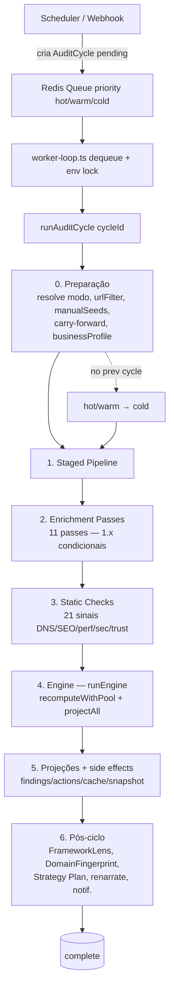
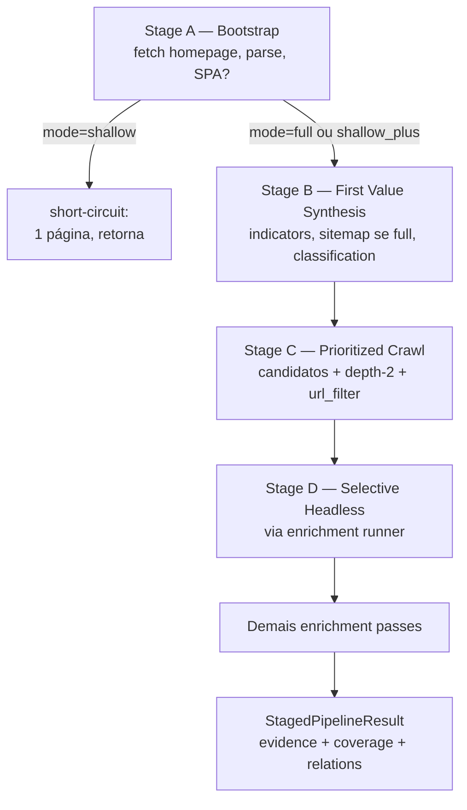
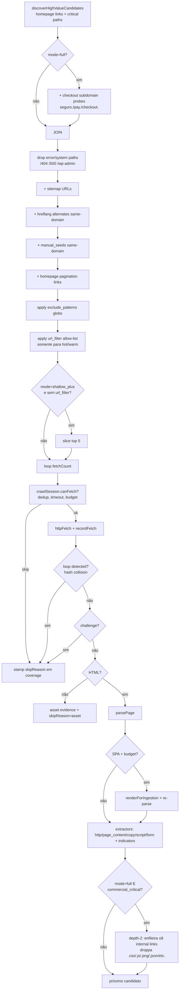
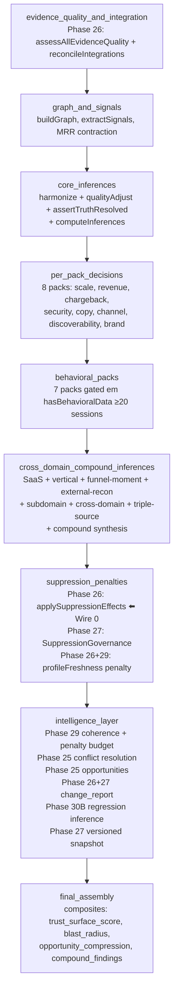

# Vestigio Audit Architecture — End-to-End Reference

> Referência viva do que a auditoria efetivamente faz, estágio por estágio,
> ramificação por ramificação. Atualizar quando o pipeline mudar.

Última revisão: 2026-06-09 (após Wire 0, Tavily-replace-Brave, nuclei v3.8.0 / katana v1.6.1 no Docker `tools` stage).

---

## High-Level Flow



Pontos de entrada (file:LINE):
- `apps/audit-runner/scheduler.ts:75` — decide `cycleType` por env.
- `apps/audit-runner/worker-loop.ts:163` — drena a fila Redis.
- `apps/audit-runner/run-cycle.ts:213` — `runAuditCycle(cycleId)`.

---

## 0. Cycle Preparation

### 0.1 Tipos de gatilho e resolução

`cycleType` é uma coluna em `AuditCycle`. Valores possíveis:

| cycleType | Significado | Origem |
|---|---|---|
| `cold` / `full` | baseline completo, todo o pipeline | scheduler, primeiro ciclo de env, webhook pós-pagamento |
| `warm` | crítica + amostra rotativa (~30% do inventário) | scheduler — diário/semanal por plano |
| `hot` | apenas surfaces críticas | scheduler — 15min/1h em planos Max |
| `targeted` | re-análise URL-escopada via probe-diff | `apps/audit-runner/run-cycle.ts:404` |
| `shallow` / `shallow_plus` | mini-audit anônimo / prospect scan | `/lp/audit` e Growth admin (não via run-cycle) |

Resolução em `apps/audit-runner/run-cycle.ts:394-433`:
- `declaredType = cycle.cycleType || "cold"`.
- `targeted` → tratado como hot + escopo `{ kind: 'targeted', url }` propagado ao `runEngine` (`run-cycle.ts:1845`, `packages/workspace/engine.ts:136`).
- Qualquer valor desconhecido → `cold`.

### 0.2 Pré-lookups (sequência)

Todos rodam ANTES do staged pipeline, em `run-cycle.ts`:

1. `prisma.auditCycle.findUnique` + idempotência (`run-cycle.ts:219-238`).
2. Marca `status='running'` + heartbeat seed a cada 30s (`run-cycle.ts:245-271`).
3. `prisma.website.upsert` (`run-cycle.ts:286`).
4. `businessProfile` lookup — `run-cycle.ts:377-379`.
5. Resolve `cycleMode` + `modeConfig` (`run-cycle.ts:428-456`).
6. `getPreviousCompletedCycle` — se ausente em hot/warm → **downgrade para cold** (`run-cycle.ts:443-456`).
7. `resolveCriticalSurfaces` + `buildUrlAllowList` — em hot/warm (`run-cycle.ts:458-483`).
8. `carryEvidenceForward` — pega evidência da URL fora da allow-list (`run-cycle.ts:500`).
9. `manualSeeds` — URLs adicionadas manualmente via inventário (`run-cycle.ts:534-547`).
10. (No bloco da engine, mais tarde) `integrationSnapshots` (Shopify, Nuvemshop, Meta Ads, Google Ads, Stripe) — `run-cycle.ts:1304-1623`.
11. `previousFindings` para change-class — `run-cycle.ts:1738-1745`.
12. `surfaceDeclarations` (Wave 22.5 Tier 3) — `run-cycle.ts:1764-1784`.
13. **Wire 0 — `suppressionRules`** — `run-cycle.ts:1798-1830`. Query: `scopeRef IN [workspace, env]`, `isActive=true`, `expiresAt IS NULL OR > now`.

### 0.3 Bootstrap do worker

`worker-loop.ts:259-262` instancia o OTel boot, inicializa o `recompute-pool` (worker_threads opcional via `RECOMPUTE_USE_WORKER_THREADS=1`, default in-process — ver `apps/audit-runner/recompute-pool.ts:261`), e abre o loop de dequeue.

---

## 1. Staged Pipeline

`workers/ingestion/staged-pipeline.ts:315 — runStagedPipeline`



### 1.1 Stage A — Bootstrap Discovery

`staged-pipeline.ts:362-492`.

1. `httpFetch(rootUrl)` → `HttpResponse`.
2. `detectChallenge` (Cloudflare/recaptcha/datadome/akamai) — se positivo, emite `challenge_detected` mas continua.
3. `parsePage(body, finalUrl)`.
4. **SPA detection na homepage** (`staged-pipeline.ts:390-441`): `shouldTriggerPlaywright(body, scriptCount, bodyLen)`.
   - Se SPA + `playwright_budget > 0` + por-domínio < 3: dispara `renderForIngestion` com `waitUntil='networkidle'`, 15s timeout.
   - Re-parse com o DOM renderizado, mas só se o HTML resultante for **estritamente maior** que o cru.
   - Sempre emite `PlaywrightRender` evidence (mesmo quando o budget está esgotado, com `rendered=false`).
5. Emite evidência:
   - `HttpResponse` (`staged-pipeline.ts:444`).
   - `PageContent`.
   - `CopyElements` (via `extractCopyElements` em `enrichment/copy-elements-extractor.ts`, com `pageType` e `funnelStage` derivados da URL — `staged-pipeline.ts:1238-1259`).
   - `Script` (apenas externos).
   - `Form`.
6. Anchor + form_action surface relations da homepage.

**Falha catastrófica** (homepage não fetchada): emite `stage_complete` com `success=false` e retorna. Todo o resto é pulado.

### 1.2 Stage B — First Value Synthesis

`staged-pipeline.ts:512-545`.

1. `extractIndicators` — checkout, policy, provider via regex em links/scripts.
2. **Sitemap + robots** — só roda se `mode === 'full'` (`staged-pipeline.ts:522`).
3. `computeClassification` — gera `ClassificationState` (primary_model, confidence_level) a partir das evidências.
4. Emite `score_update` e `stage_complete`.

### 1.3 Stage C — Prioritized Crawl

`staged-pipeline.ts:547-1041`.



Pontos críticos:
- `staged-pipeline.ts:558` — `getPagePriorityCriticalPaths(business_model)` (pt-BR + en + es).
- `staged-pipeline.ts:570-580` — probes `seguro.X`, `pay.X` etc. **só em full**.
- `staged-pipeline.ts:703-735` — `url_filter` intersect. Manual seeds sempre sobrevivem ao filtro.
- `staged-pipeline.ts:938-969` — **depth-2 expansion**: só `mode === 'full' && isCommercialCriticalUrl(finalUrl)`; cap de 8 pushes por página origem. Drop de assets via regex `/\.(css|js|png|jpg|jpeg|gif|svg|ico|woff2?|ttf|eot|pdf|zip|xml|json)$/i` em `staged-pipeline.ts:950`.

### 1.4 Stage D — Selective Headless

NÃO é um bloco inline da staged-pipeline — é o **primeiro enrichment pass** chamado em `staged-pipeline.ts:1059-1071` via `runEnrichmentPasses`. Implementação em `workers/ingestion/enrichment/selective-headless.ts:60`.

Gates (`selective-headless.ts:60-83`):
1. `ctx.mode === 'full'` — caso contrário, skip com motivo `mode is '...'`.
2. `landing_url` válida.
3. (gate de SPA RELAXADO em Wave atual — agora roda mesmo em sites server-rendered para detectar cookie banners, lazy-loaded trust signals, dynamic pricing).
4. Cost model: 1 execução bem-sucedida por ciclo, até 3 attempts (backoff 2s/4s/8s), retry só em classes transient (turnstile/network/launch/timeout).

Cenários renderizados (vêm de `buildStageDScenarios`): trace navegacional, confirmação de checkout, falhas (console/network).

---

## 2. Enrichment Passes

`workers/ingestion/enrichment/runner.ts:42-55` — registro:

```ts
const PASS_REGISTRY = [
  subdomainDiscoveryPass,
  emailDeliverabilityPass,
  selectiveHeadlessPass,     // = Stage D
  katanaDiscoveryPass,
  nucleiScanPass,
  brandIntelScanPass,
  competitorFetchPass,
  serpObservationPass,
  surfaceInventoryPass,
  customerVoicePass,
  externalReconPass,
  semanticEnrichmentPass,    // último: lê todo o restante
];
```

Ordem importa — passes posteriores enxergam evidência de anteriores no contexto. `runner.ts:80-94` envelopa cada pass em `try/catch`: falha em um pass nunca derruba o ciclo, vira `'failed'` result.

```mermaid
flowchart LR
    M{mode=full?} -- não --> SK1[skip todos exceto<br/>email_deliverability + semantic em shallow_plus]
    M -- sim --> SUB[subdomain]
    SUB --> EML[email_deliverability]
    EML --> SH[selective_headless]
    SH --> KAT{SPA + low commercial?}
    KAT -- sim --> KATR[katana_discovery]
    KAT -- não --> NUC
    KATR --> NUC[nuclei_scan<br/>requer binary]
    NUC --> BRA{brand tokens?}
    BRA -- sim --> BRAR[brand_intel_scan]
    BRA -- não --> CF
    BRAR --> CF[competitor_fetch<br/>requer CompetitorDomain rows]
    CF --> SERP{TAVILY_API_KEY?}
    SERP -- sim --> SERPR[serp_observation]
    SERP -- não --> SI
    SERPR --> SI{LLM + competitor snapshots?}
    SI -- sim --> SIR[surface_inventory]
    SI -- não --> CV
    SIR --> CV{competidores ativos?}
    CV -- sim --> CVR[customer_voice — Reclame Aqui]
    CV -- não --> EXT
    CVR --> EXT[external_recon]
    EXT --> SEM{LLM enabled?}
    SEM -- sim --> SEMR[semantic_enrichment]
    SEM -- não --> END[fim]
    SEMR --> END
```



### 2.1 selectiveHeadlessPass — Stage D
- Arquivo: `selective-headless.ts`. Gates: `mode='full'`. Custo: ≤186s worst-case.
- Evidência: `BrowserNavigationTrace`, `BrowserCheckoutConfirmation`, `BrowserFailureEvent`.

### 2.2 katanaDiscoveryPass
- `katana-discovery.ts:26`. Gates: `mode='full'` + `spa_detected` + heurística (`scriptCount`, `bodyWords`, `commercialPages`, router patterns).
- Subprocess `katana` (binary v1.6.1 instalado no Docker `tools` stage, commit `dc6dbbc9`).
- Evidência: `KatanaDiscovery`.

### 2.3 nucleiScanPass
- `nuclei-scan.ts:33`. Gates: `mode='full'` apenas. Checa `isNucleiAvailable()` em runtime — se ausente, skip com motivo "binary not installed". v3.8.0 no Docker.
- Famílias: `payment_integrity`, `channel_trust`, `commerce_continuity`, `trust_posture`, `abuse_exposure`.
- Limites: `max_templates=50`, `timeout=120s`, `rate_limit=10`.
- Evidência: `NucleiMatch` normalizada por família.

### 2.4 brandIntelScanPass
- `brand-intel-scan.ts:108`. Gates: `mode='full'` + brand tokens deriváveis do root domain.
- DNS + HTTP similarity scoring. Filtra low-confidence antes de emitir.
- Evidência: `BrandImpersonationMatch`.

### 2.5 competitorFetchPass
- `competitor-fetch.ts:519`. Gates: `mode='full'` + `envId` resolvível + `CompetitorDomain` rows ativos.
- Cap: 10 competidores/ciclo. SSRF-hardened fetch via `packages/url-normalize/ssrf`. DNS lookup DMARC/SPF dos competidores.
- Evidência: `CompetitorPageSnapshot`.

### 2.6 serpObservationPass
- `serp-observation.ts:169`. Gates: `mode='full'` + `getSerpProvider()` ≠ null (lê `TAVILY_API_KEY` — Brave foi removida no commit `97260de6`).
- ≤4 queries por env por ciclo (1 brand + 3 category). Cache TTL 24h.
- Side effect: hosts que aparecem em ≥2 result lists viram `CompetitorDomain` row com `discoveryMethod='auto'`, `active=false`.
- Evidência: `SerpResults`.

### 2.7 surfaceInventoryPass
- `surface-inventory.ts:377`. Gates: `mode='full'` + `isLlmEnabled()` (lê `ANTHROPIC_API_KEY`) + ≥1 `CompetitorPageSnapshot` no contexto.
- 1 chamada Haiku por página fonte (você + cada competidor), cacheado por `content_hash`. Cap 1+10=11 calls/ciclo.
- Evidência: `ContentEnrichment` com `enrichment_type='surface_inventory'`.

### 2.8 customerVoicePass
- `customer-voice.ts:158`. Gates: `mode='full'` + `envId` resolvível + `root_domain ≥ 3 chars`. NOTA: **NÃO há gate `RECLAME_AQUI_BASE_URL`** — a query vai para DDG SERP (snippet scrape). Single source via `scrapeReclameAqui`.
- Cap 5 competidores/ciclo.
- Evidência: `CustomerVoiceSnapshot` (platform=`reclame_aqui`).

### 2.9 externalReconPass
- `external-recon.ts:108`. Gates: `mode='full'` + `root_domain` presente.
- Sub-fetchers (cada um wrapped em try/catch): industry-listings, DDG branded SERP, DDG category SERP, Trustpilot, Reclame Aqui (via DDG), HackerNews, Reddit, AI bot access, AI machine-readable, AI schema audit, Wikipedia depth, AI comparison ownership.
- Cadência: cron semanal por env (gerenciado pelo scheduler em `instrumentation-node`). Pipeline-level só dispara em full + freshness check >7d.
- Evidência: `OffSiteRecon` (uma por source, com `reachable=false` quando falha).

### 2.10 semanticEnrichmentPass
- `semantic-enrichment.ts:873`. Gates: `mode IN ['full', 'shallow_plus']` + `isLlmEnabled()`.
- Roda múltiplos sub-enrichments LLM-backed:
  - policy quality (Haiku)
  - cross-page consistency
  - pricing psychology (`pricing-psychology.ts`)
  - localization quality (`copy-localization.ts`)
  - micro copy (`copy-micro-copy.ts`)
  - SEO/conversion tension (`copy-seo-tension.ts`)
  - copy staleness (`copy-staleness.ts` — regex-only, sem custo LLM)
  - structured data validation (`structured-data-validation.ts`)
- `MAX_PAGES = 25` páginas/ciclo. Cache via `content-cache` por `hashContentInput`.
- Evidência: `ContentEnrichment` com vários sub-tipos.

### 2.11 subdomainDiscoveryPass
- `subdomain-discovery.ts:130`. Gates: `mode='full'` apenas.
- Query crt.sh + verifica via DNS resolve + HTTP HEAD. Cap 50 subdomínios.
- Evidência: `SubdomainDiscovery` rows.

### Pass extra: emailDeliverabilityPass

- `email-deliverability.ts:257`. **Sem gate por mode** — roda em todos os modos (cost bound ~200ms).
- Pure DNS: SPF, DKIM (12 selectors probed), DMARC, BIMI.
- Evidência: 1 `EmailAuthRecord` por env por ciclo.

---

## 3. Static Checks

`workers/ingestion/stages/static-checks.ts:44 — runStaticChecks`.

Chamado em `run-cycle.ts:1659-1671`, ANTES do `runEngine`, e os sinais resultantes entram via `additional_signals` que (Wave 20.5) são merged pré-harmonize em `recompute.ts:417-419`.

**21 sinais em 5 categorias**:

| Categoria | Sinais |
|---|---|
| DNS/Email | spf_record_check (1), dkim_record_check (2), dmarc_record_check (3) |
| SEO/Discoverability | 6 sinais (linha 186) — meta tags, robots, sitemap, canonical, structured data |
| Performance | 4 sinais (linha 373) — derivados de `http_response.duration_ms` |
| Security | 4 sinais (linha 498) — incluindo `referrer_policy_missing` em checkout (603) |
| Conversion/Trust | 4 sinais (linha 633) — broken social patterns, contact, lang mismatch |

Diferencial vs extractors da engine: opera sobre evidência **agregada por env** (não por-página) e cita evidência já persistida no DB. Cobre o que `extractSignals` não cobre por design (que olha 1 página por vez).

---

## 4. Engine

### 4.1 runEngine / runEngineWithPool

`packages/workspace/engine.ts:122 — run(input)`.

Contrato: `EngineRunInput` → `EngineRunOutput` (`{ multipack, projections, scope }`).

Internals:
1. `scope = input.scope ?? { kind: 'full_cycle' }`.
2. `recomputeFn = input.recompute ?? recomputeAllAsync`. O audit-runner passa `recomputeWithPool` (`apps/audit-runner/recompute-pool.ts:261`) que, com `RECOMPUTE_USE_WORKER_THREADS=1`, faz off-load para worker_threads V8-isolate.
3. `multipack = await recomputeFn(input, input.onPhase)` — onde `onPhase` persiste fase no `AuditCycle` (`run-cycle.ts:1896-1926`).
4. `projections = projectAll(multipack, translations, { previousFindings })`.
5. Se `scope.kind === 'targeted'`: `filterProjectionsByUrl(projections, scope.url)` — `engine.ts:151`.

### 4.2 recompute — Generator com phase boundaries

`packages/workspace/recompute.ts:377 — recomputeAllGen` é um generator. Yield points definem fases observáveis:



Pontos numerados (file:LINE em `packages/workspace/recompute.ts`):
- `:402` yield `evidence_quality_and_integration` — `assessAllEvidenceQuality` + `reconcileIntegrations`.
- `:460` yield `graph_and_signals` — `buildGraph`, `extractSignals`, MRR contraction (Wave 8.1).
- `:476` `extractSaasSignals` pre-harmonize (Wave 20.6).
- `:492` `stampSignalSurfaceKinds` com `surface_resolver` (Wave 22.5 Tier 3).
- `:497` `harmonizeSignals` (truth resolution).
- `:500` `guardTruthConsistency` (Phase 27).
- `:507` `adjustConfidenceByQuality` (Phase 26).
- `:517` `assertTruthResolved` em **THROW mode**.
- `:531` yield `core_inferences`.
- `:545-646` 8 produceDecision calls por pack.
- `:648` yield `per_pack_decisions`.
- `:651-669` payment_health pack gated em `commerceContext.failed_payment_rate || subscriber_churn_rate`.
- `:672-694` content_freshness pack gated em inferências disponíveis.
- `:736` `computePackEligibility` — drives "pack greyed out?".
- `:752-788` saas_growth_readiness pack gated em `packEligibility.saas_pack.eligible`.
- `:812-840` 7 behavioral packs gated em `hasBehavioralData ≥ 20 sessions`.
- `:842` yield `behavioral_packs`.
- `:845-934` `computeVerticalInferences`, `computeFunnelMomentInferences`, `computeExternalReconInferences` (com `previous_snapshot.signals` para trajetória), `computeSubdomainCrossDomainInferences`, `computeCrossDomainInferences`, `computeTripleSourceInferences`.
- `:953-974` merge stamped + `applySurfaceGate` (`warn` default, `throw` com `SURFACE_GATE_MODE=throw`) + `computeCrossPackSynthesis`.
- `:976` yield `cross_domain_compound_inferences`.
- `:1027-1058` **Phase 26 — applySuppressionEffects** (Wire 0: reduz confidence dos decisions matched, NUNCA esconde).
- `:1060-1066` **Phase 27 — computeSuppressionGovernance** (blind spots, escalações).
- `:1068-1121` Phase 26+29 — `evaluateProfileFreshness` → graduated `profileConfidencePenalty`.
- `:1123` yield `suppression_penalties`.
- `:1152` `estimateImpact` com `funnel_multipliers` (multiplicadores stage 0–4 vindos de classified pages).
- `:1156` `resolveDecisionConflicts` (Phase 25).
- `:1158-1199` Phase 29 — coherence consequences (`coherenceScore < 70` → 0.65 floor multiplier).
- `:1201-1244` **Phase 29 — Cross-layer penalty budget** (`PENALTY_BUDGET_FLOOR = 0.40`, ou seja, máx 60% redução acumulada).
- `:1245-1253` E7 fix — remove ações de decisions com confidence <20.
- `:1256` `produceIntelligence`.
- `:1264` `generateOpportunities` (Phase 25).
- `:1268-1314` Phase 26+27 — `detectChanges(previous_snapshot, currentSnapshot)` + `computeRevenueRecovery`.
- `:1316-1349` **Phase 30B — regression inference injection**.
- `:1352-1358` Phase 27 — `createVersionedSnapshot`.
- `:1366` `detectMaturityStage`.
- `:1374` yield `intelligence_layer`.
- `:1481` `buildConfidenceAudit` (Phase 29 instrumented).
- `:1484` `validateBehavior` (Phase 27).
- `:1487-1522` Wave 3.4 composites: `trust_surface_score`, `blast_radius`, `opportunity_compression`, `detectCompoundFindings`.

Phase persistence: `recomputeAllAsync` (`recompute.ts:1570`) drena o generator com `setImmediate` entre yields, emite OTel span por phase, e dispara o callback `onPhase` que o audit-runner usa para gravar `currentPhase`/`phaseHistory` no `AuditCycle` (`run-cycle.ts:1896-1926`).

### 4.3 projectAll

`packages/projections/engine.ts → projectAll(multipack, translations, { previousFindings })`. Resultado: `ProjectionResult` com:
- `findings: FindingProjection[]` — change-class calculado por inferência (new_issue/regression/improvement/stable_risk) usando `previousFindings`.
- `actions: ActionProjection[]` — linked_findings.
- `workspaces: WorkspaceProjection[]` — agregados por pack.
- `change_report` — derivado do `multipack.change_report`.
- `maps` — depois construídos por `buildAllMaps` (`run-cycle.ts:2069`).

---

## 5. Projections & Side Effects

### 5.1 Finding lifecycle (Wave 20.4)

`run-cycle.ts:1943-1961` — `applyLifecycle(projections.findings, priorStates)`:
- Match por `(inferenceKey, surface)`.
- Status transitions: `created → confirmed → stale → resolved → regressed`.
- Phantom `'resolved'` rows appended para a query value-caught.

### 5.2 Persistência transacional

`run-cycle.ts:1989-2102` — single Prisma interactive tx, timeout 30s:
1. `snapshotStore.asyncSave(snapshot, cycleId, tx, revenueData)` — `PrismaSnapshotStore`. Revenue extraído de Stripe > Shopify > Nuvemshop.
2. `findingStore.saveForCycle` — `PrismaFindingStore`. Se `attempted > 0 && written === 0` → throw "catastrophic findings persistence loss" → rollback → cycle marcado FAILED.
3. `actionStore.saveForCycle` — `PrismaActionStore`. Falha aqui é logada mas não fatal (degrada para projectionsCache).
4. `tx.auditCycle.update` com `status='complete'`, `projectionsCache` JSON (findings, actions, workspaces, change_report, maps, coherence, system_health, compound_findings).

### 5.3 Denormalizações pós-tx

- `findingCount` por URL — `run-cycle.ts:2127-2157`. Keyed em `f.source_url` (correção do bug Wave 18g+ onde antes usava `f.surface`).
- `sessionCount30d` via `GROUP BY url` em `RawBehavioralEvent` — `run-cycle.ts:2163-2186`.

### 5.4 Behavioral session aggregation

`apps/audit-runner/process-behavioral.ts:81 — processBehavioralEventsForEnv`. Lê `RawBehavioralEvent`, agrega via `packages/behavioral/session-aggregator.ts`, retorna `BehavioralSessionPayload` evidence appendado à pool antes do `runEngine`. Window do lookback é função do mode (`modeConfig.behavioralWindowHours`: hot=1h, warm=24h, cold=720h).

### 5.5 Framework Lens

`apps/audit-runner/run-framework-lens.ts:194 — runFrameworkLensForCycle`. Roda APENAS em **cold cycle** (`run-cycle.ts:2206-2225`). Pre-popula 4 lens cells (home/pricing/features/about) via Haiku, persiste em `CopyFrameworkAudit` rows. Best-effort: timeout/rate-limit não bloqueia o ciclo. On-demand fallback existe em `/api/workspace/copy-framework-audit`.

### 5.6 Domain Fingerprint

`apps/audit-runner/populate-domain-fingerprint.ts:112 — populateDomainFingerprint`. Cold-only, 90-day freshness gate. 1 Haiku call quando precisa refresh; 0 calls quando dentro da janela.

### 5.7 Notification triggers

`src/libs/notification-triggers.ts`:
- `triggerIncidentNotifications` — `run-cycle.ts:2296`. Críticos novos.
- `triggerRegressionNotifications` — `run-cycle.ts:2314`. `change_severity IN ['significant','critical']`.
- `triggerStrategyPlanReadyEmail` — `run-cycle.ts:2446`. Primeiro plano do mês.
- Re-narrate triggers (`run-cycle.ts:2476-2554`): `new_critical`, `regression_chain` (≥3), `probe_surface_change`, `chronic_detected`.

### 5.8 Attribution confirmation + Strategy Plan

- `run-cycle.ts:2339-2363` — `runAttributionConfirmation` carimba `verifiedResolvedAt` em UserActions quando o ciclo confirma a resolução.
- `run-cycle.ts:2386-2467` — first-cycle Strategy Plan generation (Wave 22.6 Step 5). Claim atômico via `MonthlyStrategyPlan.@@unique([envId, month])` previne dupla geração em ciclos quase-simultâneos.

### 5.9 Usage meter + pruning

- `run-cycle.ts:2600` — `findingStore.pruneOlderThan(env.id, 2)` — mantém só os 2 ciclos mais recentes de findings.
- `run-cycle.ts:2613` — `recordCycleUsage` (pay-as-you-go: cycles_run, pages_crawled, compute_seconds).

---

## 6. Gate Reference

| Estágio / Pass | Gate | Origem (file:LINE) |
|---|---|---|
| Stage A SPA fallback Playwright | `homepageLooksLikeSpa && playwright_budget > 0 && per-domain < 3` | `staged-pipeline.ts:395-441` |
| Stage A bootstrap | `httpFetch(rootUrl)` sucesso | `staged-pipeline.ts:371` |
| Stage B sitemap/robots | `mode === 'full'` | `staged-pipeline.ts:522` |
| Stage C checkout subdomain probes | `mode === 'full'` | `staged-pipeline.ts:570` |
| Stage C error/system path filter | sempre — `isErrorOrSystemPath(url)` | `staged-pipeline.ts:588` |
| Stage C exclude_patterns | `excludePatterns.length > 0` | `staged-pipeline.ts:674-682` |
| Stage C url_filter intersect | hot/warm cycles (`input.url_filter` set) | `staged-pipeline.ts:703-735` |
| Stage C shallow_plus slice 5 | `mode === 'shallow_plus' && !input.url_filter` | `staged-pipeline.ts:745-747` |
| Stage C Playwright per-page | `looksLikeSpa && playwright_budget > 0 && perDomain < 3` | `staged-pipeline.ts:855-911` |
| Stage C depth-2 | `mode === 'full' && isCommercialCriticalUrl(finalUrl)`; cap 8 push/source | `staged-pipeline.ts:938-969` |
| Stage D / selective_headless | `mode === 'full'` (gate SPA relaxado) | `selective-headless.ts:60-83` |
| katana_discovery | `mode='full' && spa_detected && evaluateKatanaConditions ok` + `isKatanaAvailable` runtime | `katana-discovery.ts:26-314` |
| nuclei_scan | `mode='full'` + `isNucleiAvailable` runtime | `nuclei-scan.ts:33-216` |
| brand_intel_scan | `mode='full'` + brand tokens deriváveis | `brand-intel-scan.ts:108-123` |
| competitor_fetch | `mode='full'` + envId resolvível + CompetitorDomain rows ativos | `competitor-fetch.ts:519-537` |
| serp_observation | `mode='full'` + `TAVILY_API_KEY` set + envId | `serp-observation.ts:169-189` |
| surface_inventory | `mode='full'` + `ANTHROPIC_API_KEY` + ≥1 CompetitorPageSnapshot evidence | `surface-inventory.ts:377-397` |
| customer_voice | `mode='full'` + envId + root_domain ≥3 chars (não exige `RECLAME_AQUI_BASE_URL`) | `customer-voice.ts:158-176` |
| external_recon | `mode='full'` + root_domain (cadência cron semanal) | `external-recon.ts:108-122` |
| email_deliverability | sempre (DNS bound a ~200ms) | `email-deliverability.ts:257-262` |
| subdomain_discovery | `mode='full'` | `subdomain-discovery.ts:130-138` |
| semantic_enrichment | `mode IN ['full','shallow_plus']` + `isLlmEnabled()` + páginas com conteúdo | `semantic-enrichment.ts:873-895` |
| Stage A→B fallback (no shallow) | `mode === 'shallow'` → short-circuit, retorna 1 página | `staged-pipeline.ts:497-508` |
| ad_message_match LLM enrichment | `cycleMode === 'cold' && integrationSnapshots.length > 0` | `run-cycle.ts:1631-1654` |
| sitemap-discovered URLs | sempre append se `sitemapUrls.length > 0` | `staged-pipeline.ts:599-609` |
| Behavioral packs (7) | `hasBehavioralData ≥ 20 sessions` no payload | `recompute.ts:812-818` |
| SaaS growth readiness pack | `packEligibility.saas_pack.eligible` | `recompute.ts:752` |
| Payment health pack | `commerceContext.failed_payment_rate ‖ subscriber_churn_rate` (Stripe ligado) | `recompute.ts:651-669` |
| Content freshness pack | inferências `commercial_page_stale ‖ pricing_page_outdated ‖ social_proof_expired ‖ content_decay_progression` presentes | `recompute.ts:672-694` |
| Vertical pack | `verticalInferences.length > 0` | `recompute.ts:854-863` |
| Funnel journey pack | `funnelMomentInferences.length > 0` | `recompute.ts:907-914` |
| Suppression effects (Wire 0) | `suppressionRules.length > 0` | `recompute.ts:1030` |
| Coherence penalty | `coherenceScore < 70` | `recompute.ts:1160` |
| E7 — actions removal | `decision.confidence_score < 20` | `recompute.ts:1248` |
| Regression inference injection | `changeReport.regressions[i].severity IN ['notable','significant','critical'] && reason !== 'data_source_expanded'` | `recompute.ts:1320-1349` |
| Framework Lens | `cycleMode === 'cold'` | `run-cycle.ts:2206`, `run-framework-lens.ts` |
| Domain Fingerprint | cold cycle + freshness >90d | `populate-domain-fingerprint.ts:112` |
| ad-LP message match | `cycleMode === 'cold'` + integrationSnapshots presentes | `run-cycle.ts:1631` |
| triggerRegressionNotifications | regressões `'significant' ‖ 'critical'` | `run-cycle.ts:2308-2330` |
| Strategy Plan first-cycle | nenhum `MonthlyStrategyPlan` existente para env | `run-cycle.ts:2397-2461` |

---

## 7. Mode Matrix

| Mode | Roda | Pula | Gatilho típico | Wall-clock budget |
|---|---|---|---|---|
| `cold` / `full` | A + B (com sitemap/robots) + C (com depth-2 + probes) + Stage D + TODOS enrichments (subdomain, katana, nuclei, brand, competitor, serp, surface, customer voice, recon, semantic) + Framework Lens + Domain Fingerprint + ad-LP message-match | nada | primeiro ciclo, webhook pós-pagamento, scheduler cold (semanal/mensal por plano) | 10 min |
| `warm` | A + B (sem sitemap) + C truncado (url_filter critical + amostra rotativa) + email_deliverability + semantic_enrichment | Stage D, katana, nuclei, brand, competitor, serp, surface, customer voice, recon, Framework Lens, Domain FP, ad-match | scheduler warm (diário por plano) | 4 min |
| `hot` | A + B (sem sitemap) + C com url_filter critical | Stage D + todos os enrichments LLM/external (exceto email_deliverability) | scheduler hot (15min/1h por plano Max), targeted re-analysis | 60 s |
| `targeted` | igual a hot + escopo `{ kind: 'targeted', url }` passa via `runEngine` para filtrar `projections` ao URL | mesmo que hot | probe-diff cron (`scopeJson.triggered_by='probe_diff'`) | 60 s |
| `shallow_plus` | A + B + 5 primeiros candidatos de C + semantic_enrichment + email_deliverability | Stage D + todos os outros | Growth admin prospect scans | 15 s |
| `shallow` | só A (1 fetch da homepage) | tudo mais | `/lp/audit` mini-audit anônimo | 5 s |

---

## 8. Quick Reference: File:Line Index

### Audit runner
- `apps/audit-runner/run-cycle.ts:213` — `runAuditCycle`
- `apps/audit-runner/run-cycle.ts:394` — cycleType resolution
- `apps/audit-runner/run-cycle.ts:443` — hot/warm → cold downgrade
- `apps/audit-runner/run-cycle.ts:554` — `runStagedPipeline` call
- `apps/audit-runner/run-cycle.ts:1659` — `runStaticChecks`
- `apps/audit-runner/run-cycle.ts:1798` — **Wire 0 suppression rules load**
- `apps/audit-runner/run-cycle.ts:1838` — `runEngine` call
- `apps/audit-runner/run-cycle.ts:1944` — `applyLifecycle`
- `apps/audit-runner/run-cycle.ts:1989` — persistence transaction
- `apps/audit-runner/run-cycle.ts:2206` — Framework Lens
- `apps/audit-runner/run-cycle.ts:2386` — Strategy Plan first-cycle
- `apps/audit-runner/worker-loop.ts:163` — main loop
- `apps/audit-runner/scheduler.ts:75` — cycleType decision
- `apps/audit-runner/cycle-modes.ts:58` — CYCLE_MODE_CONFIG
- `apps/audit-runner/recompute-pool.ts:261` — recomputeWithPool
- `apps/audit-runner/process-behavioral.ts:81` — behavioral aggregation
- `apps/audit-runner/run-framework-lens.ts:194` — framework lens
- `apps/audit-runner/populate-domain-fingerprint.ts:112` — fingerprint

### Staged pipeline
- `workers/ingestion/staged-pipeline.ts:315` — `runStagedPipeline`
- `workers/ingestion/staged-pipeline.ts:362` — Stage A start
- `workers/ingestion/staged-pipeline.ts:497` — shallow short-circuit
- `workers/ingestion/staged-pipeline.ts:512` — Stage B start
- `workers/ingestion/staged-pipeline.ts:547` — Stage C start
- `workers/ingestion/staged-pipeline.ts:938` — depth-2 expansion
- `workers/ingestion/staged-pipeline.ts:1059` — `runEnrichmentPasses`

### Enrichment
- `workers/ingestion/enrichment/runner.ts:42` — PASS_REGISTRY
- `workers/ingestion/enrichment/selective-headless.ts:60` — Stage D shouldRun
- `workers/ingestion/enrichment/katana-discovery.ts:26` — gates
- `workers/ingestion/enrichment/nuclei-scan.ts:33` — gates
- `workers/ingestion/enrichment/brand-intel-scan.ts:108` — gates
- `workers/ingestion/enrichment/competitor-fetch.ts:519` — gates
- `workers/ingestion/enrichment/serp-observation.ts:169` — gates (TAVILY_API_KEY)
- `workers/ingestion/enrichment/surface-inventory.ts:377` — gates (ANTHROPIC_API_KEY + competitor snapshot)
- `workers/ingestion/enrichment/customer-voice.ts:158` — gates
- `workers/ingestion/enrichment/external-recon.ts:108` — gates
- `workers/ingestion/enrichment/email-deliverability.ts:257` — no gate (always)
- `workers/ingestion/enrichment/subdomain-discovery.ts:130` — gates
- `workers/ingestion/enrichment/semantic-enrichment.ts:873` — gates (LLM + mode)

### Static checks
- `workers/ingestion/stages/static-checks.ts:44` — `runStaticChecks`

### Engine
- `packages/workspace/engine.ts:122` — `run(input)`
- `packages/workspace/recompute.ts:377` — `recomputeAllGen` (generator)
- `packages/workspace/recompute.ts:402` — yield evidence_quality_and_integration
- `packages/workspace/recompute.ts:460` — yield graph_and_signals
- `packages/workspace/recompute.ts:531` — yield core_inferences
- `packages/workspace/recompute.ts:648` — yield per_pack_decisions
- `packages/workspace/recompute.ts:842` — yield behavioral_packs
- `packages/workspace/recompute.ts:976` — yield cross_domain_compound_inferences
- `packages/workspace/recompute.ts:1027` — **Phase 26 suppression** (Wire 0 application)
- `packages/workspace/recompute.ts:1060` — Phase 27 governance
- `packages/workspace/recompute.ts:1123` — yield suppression_penalties
- `packages/workspace/recompute.ts:1201` — **Phase 29 penalty budget**
- `packages/workspace/recompute.ts:1316` — Phase 30B regression inference
- `packages/workspace/recompute.ts:1374` — yield intelligence_layer
- `packages/workspace/recompute.ts:1570` — `recomputeAllAsync` (drainer + onPhase)

### Projections + persistence
- `packages/projections/engine.ts` — `projectAll`
- `packages/projections/lifecycle.ts` — `applyLifecycle`
- `packages/projections/prisma-finding-store.ts` — `PrismaFindingStore`
- `packages/projections/prisma-action-store.ts` — `PrismaActionStore`
- `packages/change-detection/snapshot-store.ts` — `PrismaSnapshotStore`
- `packages/behavioral/session-aggregator.ts` — sessions → payload
- `packages/maps/index.ts` — `buildAllMaps`

### Notifications
- `src/libs/notification-triggers.ts:30` — `triggerIncidentNotifications`
- `src/libs/notification-triggers.ts:91` — `triggerRegressionNotifications`
- `src/libs/notification-triggers.ts:526` — `triggerStrategyPlanReadyEmail`

---

## Appendix: Open Questions

Itens onde a investigação não foi conclusiva ou onde há ambiguidade documentada no código:

1. **`SURFACE_GATE_MODE` default em prod**: `recompute.ts:967` resolve para `'warn'` quando env var não está setada. Não sei se está flippado para `'throw'` em prod ou ainda em warn — verificar `railway.worker.json` ou env vars do Railway.

2. **`RECOMPUTE_USE_WORKER_THREADS=1` está ligado?**: `recompute-pool.ts:261` é o injection point. Default é in-process. Se desativado em prod, todo o recompute roda no event loop do worker — observável pelo grep no Railway logs por "recompute worker pool init".

3. **Customer voice e Reclame Aqui**: O ROADMAP/spec menciona um `RECLAME_AQUI_BASE_URL`, mas o código atual (`customer-voice.ts:158`) NÃO checa essa env var — usa DDG SERP scrape direto via `scrapeReclameAqui`. Discrepância entre o que a memória registrada sugere e o código atual. Pode ter sido refatorado para DDG fallback e a memória ficou desatualizada.

4. **Ad-LP message-match enrichment**: O arquivo `ad-message-match.ts` é chamado de dentro do `run-cycle.ts:1631-1654`, **fora** do `PASS_REGISTRY` do enrichment runner. É um enrichment "órfão" que escapou da arquitetura unificada. Vale a pena absorver no runner para uniformidade.

5. **`recompute-pool` onPhase forwarding**: `recompute-pool.ts:271-273` comenta que o caminho de worker_threads "não encaminha onPhase events através do postMessage boundary". Se for ativado em prod, o dashboard SSE perde os eventos de fase. Follow-up documentado mas não implementado.

6. **Meta Ads + Google Ads integration**: snapshots são puxados (`run-cycle.ts:1414-1569`) e passados ao `runEngine`, mas conforme `MEMORY.md` o signal engine ainda não os consome — só types existem. Confirmar status com o owner.

7. **Wire 0 e shallow_plus / hot**: a query de suppression rules em `run-cycle.ts:1801` corre antes do `runEngine` independentemente do mode, mas Phase 26 (`recompute.ts:1030`) só aplica quando `suppressionRules.length > 0`. Logo, hot/warm CICLOS RECEBEM suppression — confirmado. Mas não há teste explícito disso no repo.

8. **Quantos "Phases" exatamente?** O texto do enunciado pede "29 fases", mas o código tem **8 yield boundaries** (`evidence_quality_and_integration`, `graph_and_signals`, `core_inferences`, `per_pack_decisions`, `behavioral_packs`, `cross_domain_compound_inferences`, `suppression_penalties`, `intelligence_layer`) + uma `final_assembly` implícita. Os "Phase 25/26/27/29/30B" mencionados nos comentários são tags semânticas internas (rotulando a categoria do work), não correspondem 1:1 a yield points. Não há "Phase 29" no sentido de "fase número 29 de 29".
